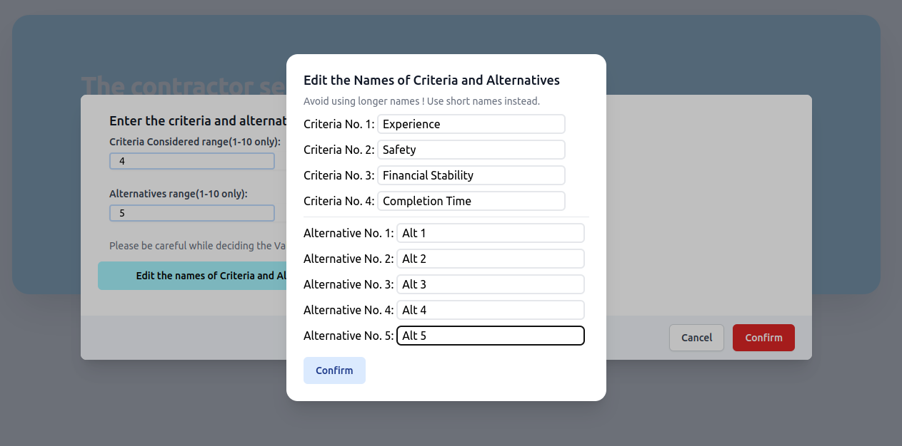
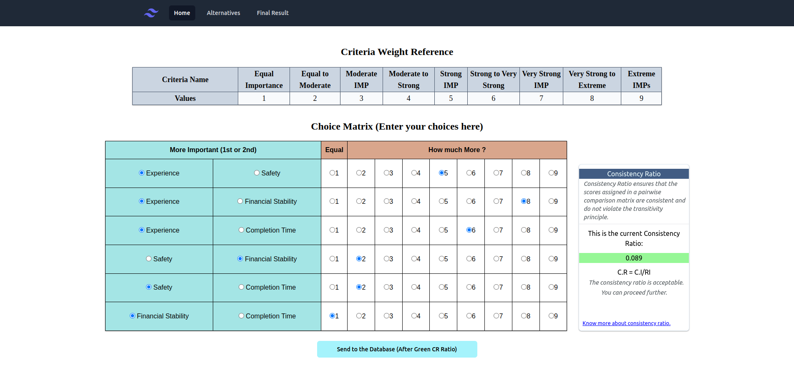
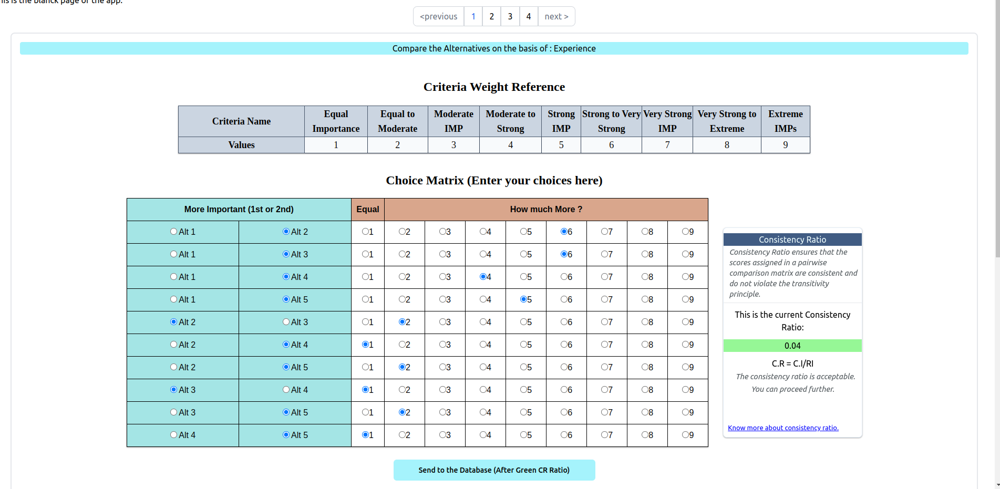
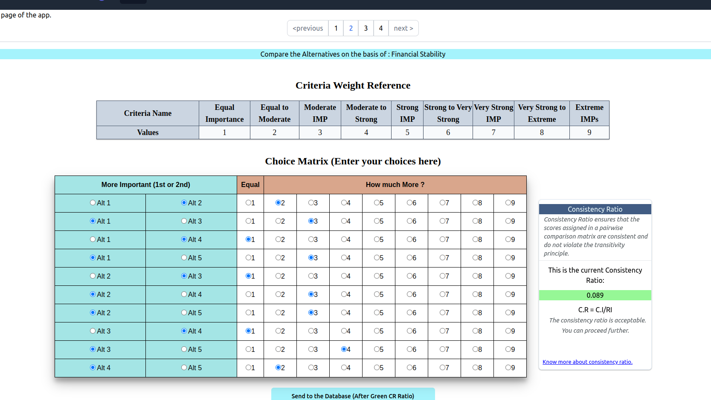
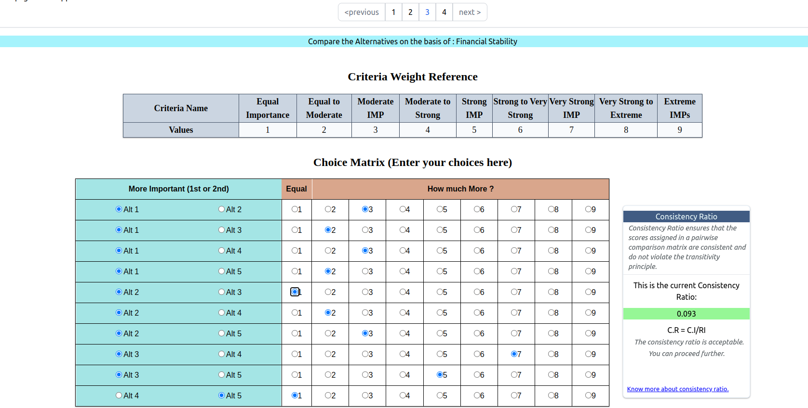
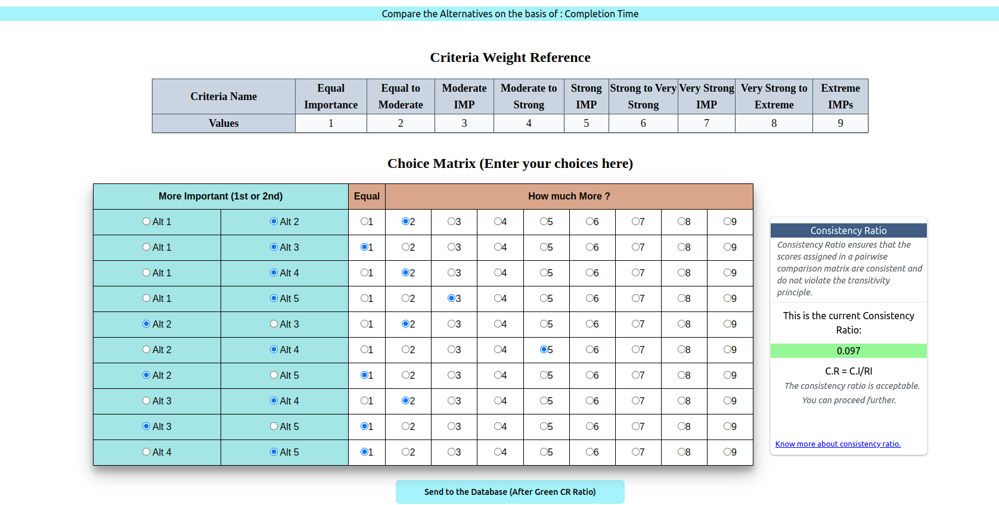
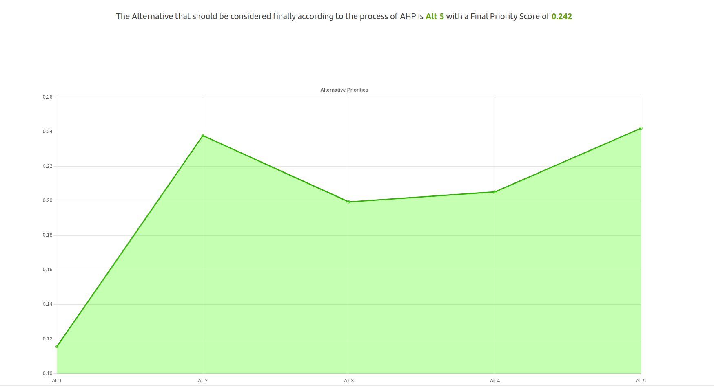
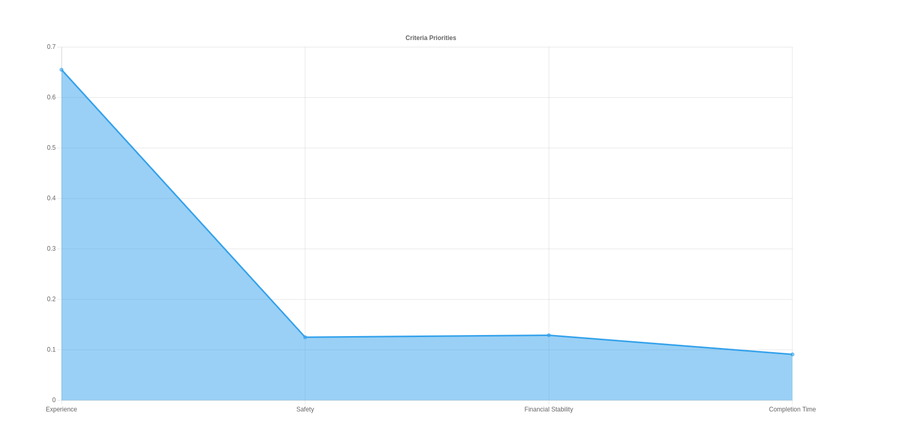

# Analytical-Hierarchial-Process Evaluator

## Problem Statement:

The 'In-General' methodology for assignment of a contract (usually by a Government body ) for any project (say construction, services) is using the lowest-bidding technique. The contractor who bids the lowest amount above some cap is usually preferred for the final approval. This may lead to biased or incorrect selection of a contractor, which may pose the risk of bad quality of final product delivered.  

The Analytical Hierarchy Process was developed by Thomas M. Saaty. This is a **Decision Making Model** that takes in range of inputs namely : Criteria and Alternatives. By using some mathematical calculations a prority vector is calculated for the Alternatives on the basis of criterias. This in return gives us a final most optimal Alternative to be selected.

## Using the Application

### Build of the Application.

1. (For FrontEnd) From the `*Main` branch:

   1. `git pull`  or download as zip.

   2. `npm install` for installing all the dependencies.

2. (For Backend) From the ` *django-backend ` Branch:
   
    1. `git pull` or download as zip.
    
    2. `python manage.py createsuperuser` : Create a user in the Admin Panel.
    
    3. `python manage.py runserver` : Start the server. (Ensure that it runs on `http://127.0.0.1:8000/` ***only***)
    
    4. Finally run `npm start ` in the `ahp` folder of FrontEnd.
    

### Operating the Application:

1. Click on the ***Home*** Tab. Click ***Get Started*** .

2. This will open a Modal Box. For the sake of this example you may enter the data from the Criteria as 4 and Alternative as 5.
   

3. After entering the Criteria and Alternative values click on `Edit the names of Criteria and Alternatives` . Enter the names of you choice. For now change all the names of all the Criterias and Alternatives ***compulsorily***. Hit `Confirm`. Again hit `Confirm`.

4. Enter the data such that the Consistency Ratio is Acceptable or Green.You may enter the data from the image below.After getting similar results hit `Send to the Database` ***Only once***.
   
   

5. Click on the `Alternatives` Tab. For the sake of this example you may enter the following data : 
 
   1. For pagination 1. After getting similar results hit `Send to the Database` ***Only once***.
   
      
  
   2. For pagination 2.After getting similar results hit `Send to the Database` ***Only once***.
       
      
      
   3. For pagination 3.After getting similar results hit `Send to the Database` ***Only once***.
     
      
  
   4. For pagination 4.After getting similar results hit `Send to the Database` ***Only once***.
   
      
  
 6. Click `Final Result` . And hit `Get the final Result`. You should be looking at something like:
 
      
      
      
